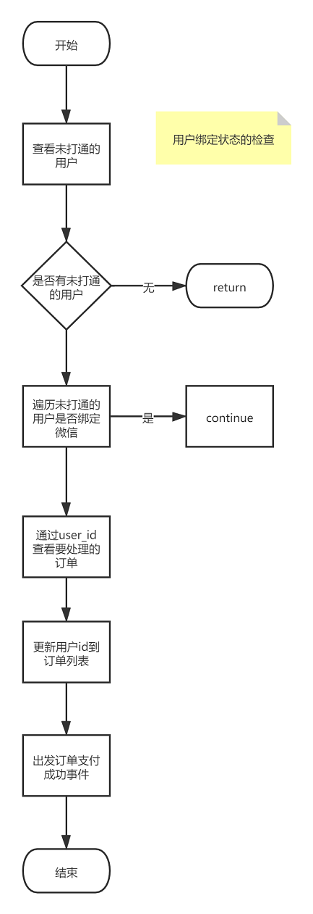

- 通过对**23个数据库**上百张表的数据筛选，完成了**2000万条数据**的遍历并对完成**图片**以及**视频域名**的**替换**。

  解决问题：

  1、解决了数据量太大rabbitmq队列执行超时的问题。

  2、解决了MySQL临时内存占用太大被系统强行杀掉的问题。

  3、解决了URL并发请求有部分未完成请求就断开导致数据量丢失问题。

  实现思路：

  

  

- 完成了订单数据拉取**定时任务**列表功能，使用**ribbitmq**异步拉取订单数据，增加了数据处理的稳定性以及生产端和消费端的解耦。

  以下是实现的流程思路：

  

- 实现了用户绑定订单的状态检查，并同步用户订单信息。出发用户支付成功事件。

  实现思路：

  

  